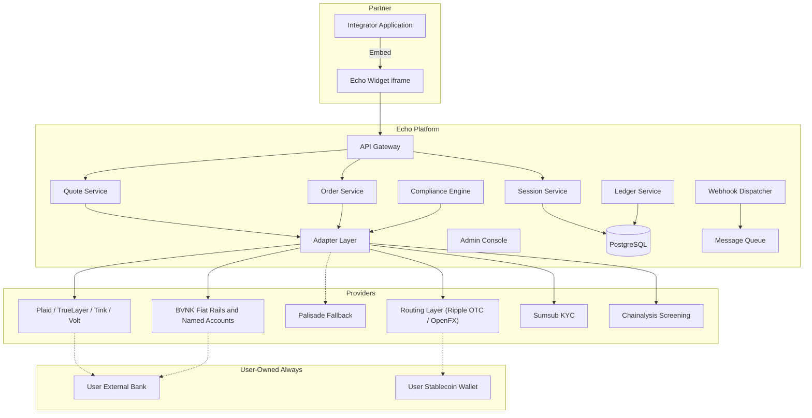

# System Design Document — Echo Ramp v1


**Version:** 1.2  
**Date:** 2026-06-18  


---


## 1. Introduction


Echo Ramp v1 is a non-custodial fiat-to-stablecoin ramp orchestration platform. It enables partner platforms (integrators) to embed an iframe/JS widget that allows their end-users to convert between fiat (via bank accounts) and stablecoins (RLUSD primary; USDC/USDT where routing partner and corridor support it), using BVNK for fiat rails and named accounts, and a configurable routing layer (Ripple OTC desk, OpenFX, and equivalents) for ramp/FX execution. Echo never holds user funds; it orchestrates identity, compliance, banking, and settlement while assets remain in user-owned bank accounts and wallets. Every outbound bank movement is initiated under the user's own authentication — Echo presents instructions in the widget but does not technically execute them.


### Core Principles
- **Non‑custodial:** Zero tolerance for holding user private keys or crypto balances.
- **High‑ticket:** Designed for OTC‑sized conversions (minimum ticket ~$10k+).
- **Embed‑first:** Distribution via partner‑embedded widget, not a standalone app.
- **Auditable:** Every state change and value movement is recorded in a unified ledger.
- **Fail‑closed:** All compliance checks (KYC, sanctions, chain screening) block progress on failure.


---


## 2. High-Level Architecture


Echo Ramp consists of three layers:


| Layer | Description | Owner |
|-------|-------------|-------|
| **Embed Layer** | iframe + JS SDK for widget; hosts UI flows (amount input, KYC, quote, wallet capture) | Echo (widget team) |
| **Orchestration Layer** | Backend microservices that coordinate sessions, quotes, orders, compliance, ledger, and integrator API | Echo (platform team) |
| **Provider Layer** | BVNK (fiat rails + named accounts), routing layer (Ripple OTC desk / OpenFX — pending partner sign-off; Palisade as interim fallback), bank aggregators, Sumsub, Chainalysis | Vendors, accessed via adapters |





The platform is entirely stateless; persistent state lives in PostgreSQL. Asynchronous operations (quote polling, order status, webhooks) go through a message queue (e.g., RabbitMQ/Redis streams).


---


## 3. Component Details


### 3.1 API Gateway
- **Role:** Single entry point for widget and integrator API.
- **Security:** API keys for integrators, TLS, rate limiting, request validation.
- **Tech:** Kong / NGINX + custom plugins.


### 3.2 Session Service
- Manages user sessions tied to an integrator.
- Stores session metadata: integrator ID, idempotency key, user reference, current state (e.g., `KYC_PENDING`, `QUOTING`, `ORDER_FILLED`).
- Enforces business rules: minimum ticket size, corridor allow‑list, jurisdiction.


### 3.3 Quote Service
- Requests quotes from the routing adapter (BVNK or configured routing partner — Ripple OTC desk, OpenFX, etc.).
- Caches quotes with expiry (Redis).
- Returns quote to widget with breakdown: provider rate, Echo fee, integrator revenue share, total, validity window.
- Handles quote expiry and rejection flows.


### 3.4 Order Service
- Accepts user‑confirmed orders.
- Submits order to the routing adapter (BVNK or configured partner).
- Monitors fill status via polling/webhook from adapter.
- On fill: records ledger entry and presents fiat movement instruction in the widget for the user to authorise. Echo does not instruct outbound bank movements on the user's behalf.


### 3.5 Compliance Engine
- **KYC:** Calls Sumsub adapter for tiered identity verification (level based on ticket size).
- **Sanctions/PEP:** Integrated with Sumsub.
- **Chainalysis:** Screens every stablecoin wallet address (user and counterparty) and on‑chain transaction.
- **Travel Rule:** Not handled by Echo. Echo operates as orchestration-only, non-custodial technology; TR responsibility sits with the licensed provider partners (BVNK, routing desk) who execute money movement.
- All KYC and screening checks must pass before a quote can be accepted or an order can progress.


### 3.6 Adapter Layer
- Abstraction for all third‑party integrations.
- Each adapter is a separate module with clear interfaces:
  - `RoutingAdapter`: quote, order, status, settlement reconciliation. Routes to BVNK, Ripple OTC desk, or OpenFX based on corridor/size config. Active provider is recorded on each order.
  - `BvnkAdapter`: provision named fiat accounts (vIBAN-style), fetch account details, fiat receipt webhooks.
  - `PalisadeAdapter`: stub adapter for interim fallback if BVNK is delayed (Sam holds existing contract); activated by config flag.
  - `BankAggregatorAdapter`: return payment authorisation session (Plaid Link token, TrueLayer redirect, etc.) for the user to complete. Receives status webhooks only — does not initiate outbound payments on Echo's behalf.
  - `SumsubAdapter`: KYC applicant creation, status polling, webhook consumption.
  - `ChainalysisAdapter`: address screening, transaction screening.
- Adapters handle retries, circuit breaking, and vendor‑specific errors.


### 3.7 Ledger Service
- **Non‑custodial event log.** Records every movement of value or state change.
- Event types:
  - `ON_RAMP`, `OFF_RAMP`, `INTERNAL_TRANSFER`, `STABLECOIN_EXCHANGE`
  - `FEE_EARNED`, `REVENUE_SHARE_ACCRUED`
- Attributes: event ID, timestamp, user ID, integrator ID, direction, fiat amount, crypto amount, RLUSD tx hash, desk order ID, status.
- The ledger is the source of truth for reconciliation, not balances.
- Immutable append‑only model (can be implemented via event sourcing or append‑only table).


### 3.8 Webhook Dispatcher
- Sends integrator webhooks for all state transitions:
  - `session.created`
  - `quote.ready`
  - `quote.accepted`
  - `order.status_changed` (e.g., `filled`, `failed`)
  - `transfer.completed`
- Supports retries with exponential backoff, dead‑letter queue, and manual replay.
- Webhook payloads include revenue share details where applicable.


### 3.9 Admin Console
- Internal tool for operations, compliance, and support.
- Features: integrator lifecycle management, manual quote override, order exception handling, compliance queue review, ledger search, webhook log viewer.


---


## 4. Key Flows


### 4.1 Off‑ramp (RLUSD → fiat)


```mermaid
sequenceDiagram
    participant User
    participant Widget
    participant APIGW
    participant SessionSvc
    participant QuoteSvc
    participant OrderSvc
    participant ComplianceSvc
    participant RoutingAdapter
    participant BvnkAdapter
    participant BankAgg as BankAggregator
    participant Ledger


    User->>Widget: Initiate off-ramp (amount)
    Widget->>APIGW: POST /sessions {type: off_ramp, amount, integrator_id}
    APIGW->>SessionSvc: create session
    SessionSvc->>ComplianceSvc: verify KYC status
    alt KYC needed
        SessionSvc-->>Widget: KYC required
        Widget->>APIGW: POST /kyc (user data)
        APIGW->>ComplianceSvc: initiate Sumsub
        ComplianceSvc-->>Widget: KYC link / status
    end
    Widget->>APIGW: POST /client/quotes
    APIGW->>QuoteSvc: request quote
    QuoteSvc->>RoutingAdapter: getQuote(pair, amount)
    RoutingAdapter-->>QuoteSvc: quote (rate, expiry, provider)
    QuoteSvc->>Ledger: record quote_created
    QuoteSvc-->>Widget: quote response with expiry countdown
    User->>Widget: Accept quote
    Widget->>APIGW: POST /client/quotes/{id}/accept
    APIGW->>OrderSvc: create order
    OrderSvc->>RoutingAdapter: submitOrder
    RoutingAdapter-->>OrderSvc: provider deposit address
    OrderSvc-->>Widget: show deposit address; instruct user to send
    Note over User,Widget: User sends stablecoin from their own wallet — Echo does not move crypto
    User->>RoutingAdapter: send stablecoin on-chain from own wallet
    Widget->>APIGW: POST /client/orders/{id}/confirm-send (tx_hash)
    OrderSvc->>ComplianceSvc: screen inbound tx (Chainalysis)
    alt screening passes
        RoutingAdapter->>OrderSvc: fill confirmation (webhook)
        OrderSvc->>BvnkAdapter: verify fiat credit to named account
        BvnkAdapter-->>OrderSvc: confirmed
        OrderSvc->>Ledger: OFF_RAMP event
        OrderSvc-->>Widget: fiat in named account; present bank transfer instruction
        Note over User,Widget: User authenticates bank transfer out — Echo presents instruction only
        User->>Widget: initiate bank transfer (user auth)
        Widget->>BankAgg: user-authenticated payment session
        BankAgg-->>APIGW: status webhook (completed)
        APIGW->>Ledger: bank_payout event
        APIGW->>OrderSvc: webhook (order.completed)
    end
```


### 4.2 On‑ramp (fiat → stablecoin)
Similar flow but in reverse. User authenticates a push payment from their external bank to their named BVNK account via the bank aggregator (Plaid etc.) — user initiates, Echo presents the instruction. The routing provider converts fiat to stablecoin and sends to the user-specified wallet address. Echo monitors confirmation and records the `ON_RAMP` ledger event.


### 4.3 RLUSD wallet‑to‑wallet (internal transfer)
- User provides source and destination wallet addresses.
- Platform screens both addresses.
- User signs transaction from their wallet; platform monitors XRPL for confirmation.
- Ledger records `INTERNAL_TRANSFER` event; no assets touch Echo.


---


## 5. Non‑Functional Requirements


### 5.1 Security
- **API authentication:** HMAC‑signed requests with integrator‑specific keys.
- **Data encryption:** TLS in transit, AES‑256 at rest for PII.
- **Secrets:** Integrator API keys, vendor credentials stored in vault (HashiCorp Vault).
- **No custody:** System never stores private keys; wallet addresses are stored encrypted.
- **Input validation:** Strict schema enforcement for all endpoints.
- **Access control:** Admin roles separated (compliance officer vs. developer).


### 5.2 Reliability
- **Uptime target:** 99.9% for API and widget delivery.
- **Idempotency:** All mutating endpoints support idempotency keys.
- **Asynchronous processing:** Critical actions (order submission, webhooks) use queues; no long‑running HTTP requests.
- **Adapter resilience:** Circuit breakers and retries for external services.


### 5.3 Performance
- API p95 latency < 200ms for read endpoints, < 2s for mutation (excluding third‑party calls).
- Quote response within 2s (cached), OTC desk SLA to be defined.
- Webhook delivery within 5s of event.


### 5.4 Scalability
- Horizontal scaling of stateless microservices.
- PostgreSQL read replicas for query‑heavy services.
- Message queue partitioning by session ID for order processing.


### 5.5 Observability
- Structured logging (JSON) with correlation IDs.
- Metrics: request rate, error rate, quote acceptance rate, order fill time, webhook delivery success rate.
- Distributed tracing (OpenTelemetry).
- Alerts on adapter failures, high webhook failure rates, KYC rejections spikes.


---


## 6. Deployment & Infrastructure


- **Environment:** Kubernetes (EKS/GKE) for production.
- **CI/CD:** GitOps with ArgoCD, images built via GitHub Actions.
- **Database:** Managed PostgreSQL (AWS RDS / Cloud SQL) with Point‑In‑Time Recovery.
- **Cache:** Redis (ElastiCache / Memorystore) for quotes and session state.
- **Queue:** RabbitMQ (or AWS SQS + SNS for webhooks).
- **Secret management:** HashiCorp Vault or cloud‑native (AWS Secrets Manager).
- **Widget delivery:** CDN (CloudFront/Cloudflare) for iframe bundle and SDK.


---


## 7. Third‑Party Integrations Summary


| Provider | API Docs | Adapter Responsibility | Status |
|----------|----------|------------------------|--------|
| BVNK | TBD (Sam) | Fiat rails, named account provisioning, fiat receipt webhooks | Pending partner sign-off |
| Ripple OTC desk | TBD (Sam) | Quotes, orders, ramp/FX execution (via `RoutingAdapter`) | Pending sign-off; routed via config |
| OpenFX | TBD | Regulated FX execution (alternative routing path) | Pending sign-off |
| Palisade | https://docs.ripple.com/products/wallet/api-docs/palisade-api/palisade-api/api-credentials | Interim fallback adapter if BVNK delayed; Sam holds existing contract | Fallback only |
| Plaid | https://plaid.com/docs/api/ | Bank link + payment authorisation session for user-initiated payments | v1 US |
| TrueLayer / Volt | https://docs.truelayer.com/ | Bank link + payment auth session, UK (Faster Payments) | v1 UK |
| Tink / Volt | TBD | Bank link + payment auth session, EU (SEPA Instant) | v1 EU |
| Sumsub | https://docs.sumsub.com/ | KYC (tiered), sanctions/PEP screening | v1 |
| Chainalysis | https://auth-developers.chainalysis.com/ | Address and transaction screening (every on-chain leg) | v1 |


---


## 8. Build Phasing


1. **Phase 0 – Platform skeleton**  
   - API Gateway, Integrator API (session, basic webhooks), Ledger service, DB schema.
   - Enforce non‑custody and user-initiated outbound invariants in code.
2. **Phase 1 – Fiat rails + off‑ramp (USD)**  
   - `BvnkAdapter` (or `PalisadeAdapter` as fallback if BVNK not yet signed).
   - `RoutingAdapter` with first routing partner (Ripple OTC desk or BVNK ramp) — added after partner sign-off.
   - Quote/Order services, Plaid adapter (user-initiated bank payment sessions).
   - Sumsub integration (tiered KYC).
   - Off‑ramp flow end‑to‑end with user-authenticated bank payout.
3. **Phase 2 – On‑ramp (USD)**  
   - User-authenticated bank push; stablecoin delivered to user wallet.
4. **Phase 3 – Internal stablecoin transfers + Chainalysis**  
   - Wallet‑to‑wallet flow, address screening.
5. **Phase 4 – Routing partners (OpenFX + additional)**  
   - Additional routing paths live after partner sign-off; `RoutingAdapter` selects by config.
6. **Phase 5 – Multi‑corridor (EUR/GBP)**  
   - TrueLayer/Tink adapters, EUR/GBP named accounts via BVNK.
7. **Phase 6 – Admin & operations tooling**  
   - Admin console, manual intervention, reconciliation tools.


—